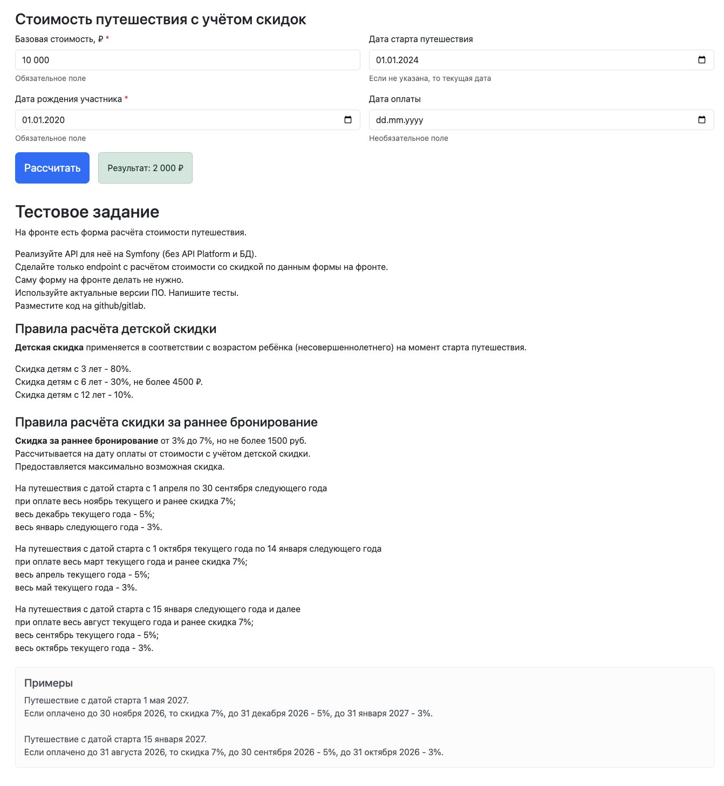

# Тестовое задание


## Установка и запуск

### 1. Установка
```
    git clone git@github.com:tlastione/AdventureTest.git
    cd AdventureTest
```
### 2. Запуск
Если у вас есть make:
```
    make install
```
Если нет make:
```
    docker compose up -d --build
    docker compose exec --user=application app composer install
```

## Дополнительная информация

* Запросы можно отправлять на http://localhost:8000/api/calculations-cost
* В Makefile есть удобные команды
* Тесты можно запустить командой 
    ```make test```
    или
    ```php bin/phpunit ``` 

## От себя

Хотел бы отметить, что в реальном проекте условия для формирования скидок лучше упростить и использовать абсолютные даты. Это было бы надёжнее и проще. В текущем задании используются относительные даты — текущий и следующий год, что усложняет логику и кажется ненадёжным решением.
Также, мне показалось, что условие сформулировано не совсем корректно и есть пересечения между отрезком с 1 апреля по 30 сентября следующего года и отрезком с 15 января следующего года и далее.

